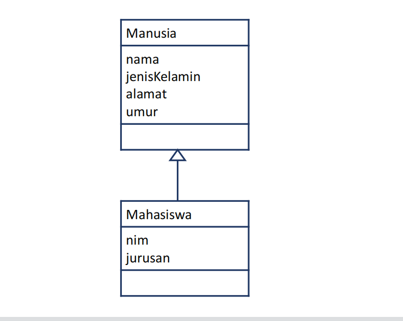
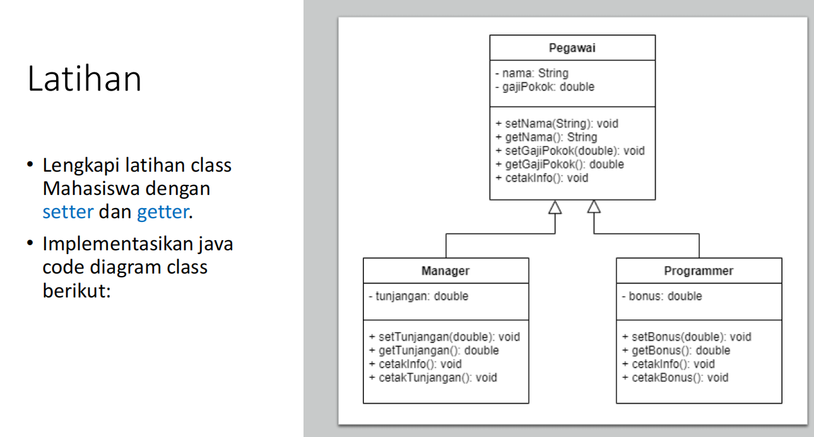
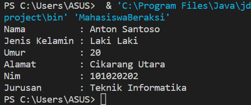
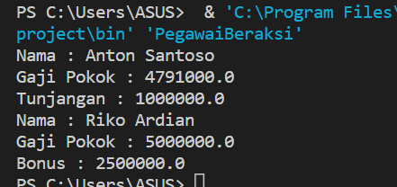

# Praktikum-3
<h3> Nama : Viena Dwi Putri Maulina </h3>
<h3> Nim : 312110469 </h3>
<h3> Kelas : TI.21.C1 </h3>
<h3> Mata Kuliah : Pemrograman Orientasi Objek</h3>
<h3> Tugas Pertemuan 6 </h3>
<br>
<p> Berikut soal latihannya </p>


<br>



<p> Jawab </p>

# Latihan 1
<br>
<p> file "Manusia.java" </p>

```java
public class Manusia {
    String nama;
    String jenisKelamin;
    int umur;
    String alamat;
    
    //setter
    public void setnama(String nama){
        this.nama = nama;
    }
    public void setjenisKelamin(String jenisKelamin){
        this.jenisKelamin = jenisKelamin;
    }
    public void setumur(int umur){
        this.umur = umur;
    }
    public void setalamat(String alamat){
        this.alamat = alamat;
    }

    //getter
    public String getnama(){
        return this.nama;
    }
    public String getjenisKelamin(){
        return this.jenisKelamin;
    }
    public int getumur(){
        return this.umur;
    }
    public String getalamat(){
        return this.alamat;
    }

    public void cetakInfo() {
        System.out.println("Nama          : " + this.nama);
        System.out.println("Jenis Kelamin : " + this.jenisKelamin);
        System.out.println("Umur          : " + this.umur);
        System.out.println("Alamat        : " + this.alamat);
    }
}
```
<p> File "Mahasiswa.java" </p>

```java
public class Mahasiswa extends Manusia{
    int nim;
    String jurusan;

    //setter
    public void setnim(int nim){
        this.nim = nim;
    }
    public void setjurusan(String jurusan){
        this.jurusan = jurusan;
    }

    //getter
    public int getnim(){
        return this.nim;
    }   
    public String getjurusan(){
        return this.jurusan;
    }
    
    public void cetakInfo() {
       super.cetakInfo();

        System.out.println("Nim           : "+ this.nim);
        System.out.println("Jurusan       : "+this.jurusan);
    }
}
```

<p> file "MahasiswaBeraksi.java" </p>

```java
public class MahasiswaBeraksi {
    public static void main(String[] args){
    // Membuat object
        Mahasiswa anton = new Mahasiswa();
    /* memanggil atribut dan memberi nilai */
        anton.setnama("Anton Santoso");
        anton.setjenisKelamin("Laki Laki");
        anton.setumur(20);
        anton.setalamat("Cikarang Utara");

        anton.setnim(101020202);
        anton.setjurusan("Teknik Informatika");
        anton.cetakInfo();
    }
 }
 ```
 <p> Outputnya adalaha <p>

 

 # Latihan 2
<br>

<p> File "Pegawai.java"</p>

```java
public class Pegawai {
    private String nama;
    private Double gajiPokok;
    
    //setter
    public void setnama(String nama){
        this.nama = nama;
    }
    public void setgajiPokok(Double gajiPokok){
        this.gajiPokok = gajiPokok;
    }
  

    //getter
    public String getnama(){
        return this.nama;
    }
    public Double gajiPokok(){
        return this.gajiPokok;
    }

    public void cetakInfo() {
       
        System.out.println("Nama        : " + this.nama);
        System.out.println("Gaji Pokok  : " + this.gajiPokok);
     
    }
}
```

<p>file "Manager.java"</p>

```java
public class Manager extends Pegawai {
    private Double tunjangan;

    public void settunjangan(Double tunjangan){
        this.tunjangan = tunjangan;
    }

    public Double tunjangan(){
        return this.tunjangan;
    }
    public void cetakInfo(){
        super.cetakInfo();
        System.out.println("Tunjangan       : " +this.tunjangan);
    }

}
```

<p>file "Programmer.java" </p>

```java
public class Programmer extends Pegawai {
    private Double bonus;

    public void setbonus(Double bonus){
        this.bonus = bonus;
    }
    
    public Double getbonus(){
        return this.bonus;
    }
    public void cetakInfo() {
        super.cetakInfo();
        System.out.println("Bonus       : " + this.bonus);
     
    }
}
```

<p>file "Pegawai Beraksi.java" </p>

```java
public class PegawaiBeraksi {
    public static void main(String[] args) {
        //membuat object
        Manager a = new Manager();
        Programmer b = new Programmer();
        a.setnama("Anton Santoso");
        a.setgajiPokok(4791000.0);
        a.settunjangan(1000000.0);
        a.cetakInfo();
        
        b.setnama("Riko Ardian");
        b.setgajiPokok(5000000.0);
        b.setbonus(2500000.0);
        b.cetakInfo();
    }
}
```
<p>Outputnya adalah </p>




